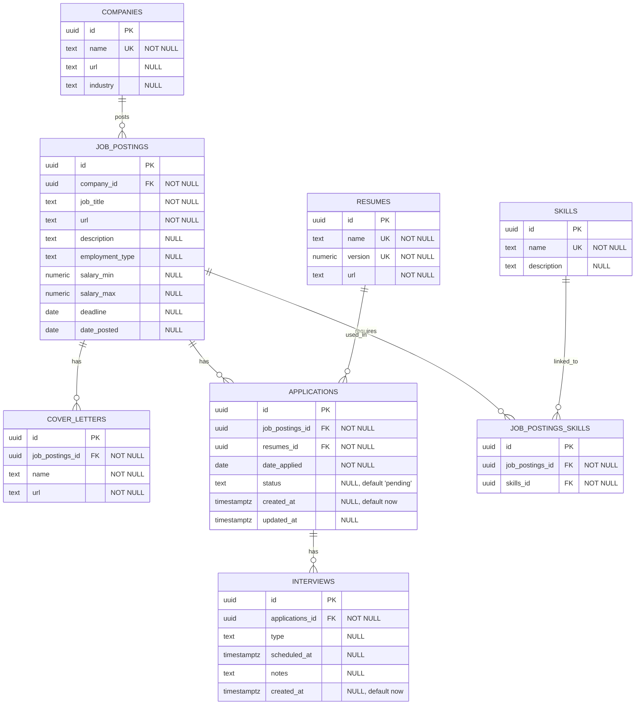

# Entity-Relationship Diagram

Generated from [models/models.py](../models/models.py).

```mermaid
erDiagram
    COMPANIES ||--o{ JOB_POSTINGS : posts
    JOB_POSTINGS ||--o{ COVER_LETTERS : has
    JOB_POSTINGS ||--o{ APPLICATIONS : has
    JOB_POSTINGS ||--o{ JOB_POSTINGS_SKILLS : requires
    RESUMES ||--o{ APPLICATIONS : used_in
    APPLICATIONS ||--o{ INTERVIEWS : has
    SKILLS ||--o{ JOB_POSTINGS_SKILLS : linked_to

    COMPANIES {
        uuid id PK
        text name UK "NOT NULL"
        text url "NULL"
        text industry "NULL"
    }

    JOB_POSTINGS {
        uuid id PK
        uuid company_id FK "NOT NULL"
        text job_title "NOT NULL"
        text url "NOT NULL"
        text description "NULL"
        text employment_type "NULL"
        numeric salary_min "NULL"
        numeric salary_max "NULL"
        date deadline "NULL"
        date date_posted "NULL"
    }

    RESUMES {
        uuid id PK
        text name UK "NOT NULL"
        numeric version UK "NOT NULL"
        text url "NOT NULL"
    }

    COVER_LETTERS {
        uuid id PK
        uuid job_postings_id FK "NOT NULL"
        text name "NOT NULL"
        text url "NOT NULL"
    }

    APPLICATIONS {
        uuid id PK
        uuid job_postings_id FK "NOT NULL"
        uuid resumes_id FK "NOT NULL"
        date date_applied "NOT NULL"
        text status "NULL, default 'pending'"
        timestamptz created_at "NULL, default now"
        timestamptz updated_at "NULL"
    }

    INTERVIEWS {
        uuid id PK
        uuid applications_id FK "NOT NULL"
        text type "NULL"
        timestamptz scheduled_at "NULL"
        text notes "NULL"
        timestamptz created_at "NULL, default now"
    }

    SKILLS {
        uuid id PK
        text name UK "NOT NULL"
        text description "NULL"
    }

    JOB_POSTINGS_SKILLS {
        uuid id PK
        uuid job_postings_id FK "NOT NULL"
        uuid skills_id FK "NOT NULL"
    }
```
